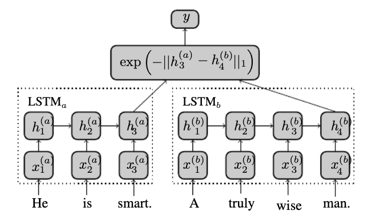

Text Similarity Analysis using Quora question pairs
---------------

Pretrained Google News Word2vec weights with Manhattan LSTM 

-----------------
Model Structure:

-------------------
Reference:

- Thyagarajan, Mueller. 2015. Siamese Recurrent Architectures for Learning Sentence Similarity. 